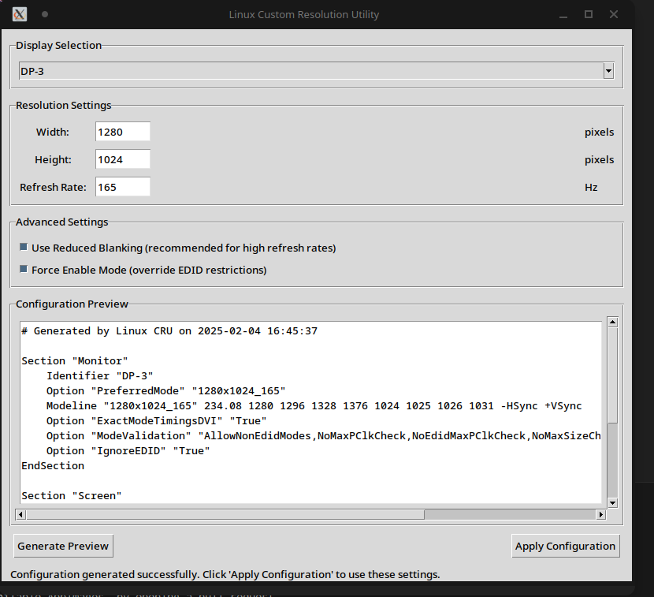

# Linux Custom Resolution Utility (Linux CRU)

A simple graphical utility for creating and applying custom display resolutions on Linux systems. This tool makes it easy to set up custom resolutions and refresh rates without manually editing configuration files.



## Features

- Simple graphical interface for creating custom resolutions
- Support for custom refresh rates
- Automatic modeline calculation
- Reduced blanking support for high refresh rates
- Force enable mode for overriding EDID restrictions
- Real-time configuration preview
- Multi-display support

## Installation

No installation required! Linux CRU is distributed as an AppImage. Just download the latest release, make it executable, and run:

```bash
chmod +x Linux_CRU-x86_64.AppImage
./Linux_CRU-x86_64.AppImage
```

## Building from Source

If you want to build the AppImage yourself:

1. Clone this repository:
```bash
git clone https://github.com/PhialsBasement/linux-cru.git
cd linux-cru
```

2. Make the build script executable:
```bash
chmod +x build_appimage.sh
```

3. Run the build script:
```bash
./build_appimage.sh
```

### Dependencies for Building

On Arch Linux:
- python
- tk
- xorg-server-utils
- imagemagick

## Usage

1. Select your display from the dropdown menu
2. Enter your desired resolution and refresh rate
3. Optionally enable reduced blanking for high refresh rates
4. Preview the configuration
5. Click "Apply Configuration" to apply the settings

The utility will generate appropriate xorg.conf and nvidia.conf files and apply them to your system.

## Warning

⚠️ Setting incorrect display configurations can lead to blank screens or display issues. Always keep a backup terminal open to revert changes if needed.

## Contributing

Contributions are welcome! Feel free to submit issues and pull requests.

## License

This project is licensed under the MIT License - see the [LICENSE](LICENSE) file for details.

## Acknowledgments

- Based on the Windows Custom Resolution Utility concept
- Uses GTK/Tk for the graphical interface
- Thanks to all contributors and testers
