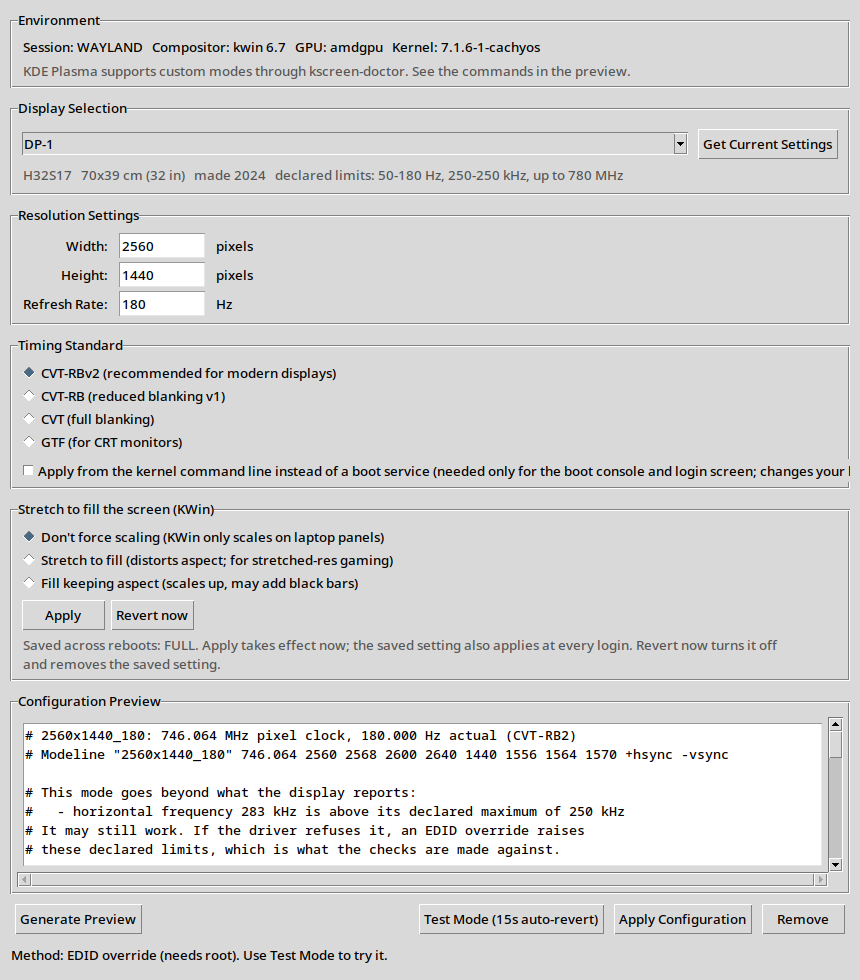

# Linux Custom Resolution Utility (Linux CRU)

A graphical utility for creating and applying custom display resolutions and refresh rates on Linux — the Linux answer to the Windows Custom Resolution Utility. It works out which of the many display paths your system uses and drives the right one for you, on X11 and Wayland, on AMD, Intel and NVIDIA.



## Features

- **Works on X11 and Wayland.** Detects your session, compositor and GPU, and picks the method that actually works there — xrandr on X11, native custom modes on KWin (Plasma 6.6+), sway and Hyprland, or a kernel EDID override everywhere else (GNOME, COSMIC, NVIDIA on Wayland).
- **Correct VESA timings.** CVT, CVT reduced-blanking, CVT-RBv2 (lowest pixel clock, best for overclocking) and GTF for CRTs — all verified against `cvt`/`gtf`.
- **Test Mode.** Applies a mode for 15 seconds and reverts on its own, so a bad mode is a brief black screen, not a reboot.
- **EDID override engine.** Patches your monitor's EDID to add modes it doesn't advertise, applied live with no reboot and optionally kept across boots via a systemd service.
- **Monitor information.** Shows what your display declares (refresh range, horizontal frequency, max pixel clock) and warns when a mode exceeds it.
- **Stretched resolutions on KWin.** Forces GPU scaling so a lower resolution fills the whole screen — the stretched-res setup competitive-shooter players want.
- Real-time configuration preview and multi-display support.

## Installation

No installation required! Linux CRU is distributed as an AppImage. Just download the latest release, make it executable, and run:

```bash
chmod +x Linux_CRU-x86_64.AppImage
./Linux_CRU-x86_64.AppImage
```

## Building from Source

If you want to build the AppImage yourself:

1. Clone this repository:
```bash
git clone https://github.com/PhialsBasement/linux-cru.git
cd linux-cru
```

2. Make the build script executable:
```bash
chmod +x build_appimage.sh
```

3. Run the build script:
```bash
./build_appimage.sh
```

The AppImage bundles Python, tkinter and the whole Tcl/Tk runtime, so it runs on a machine with no Python installed.

### Dependencies for Building

On Arch Linux:
- python
- tk
- imagemagick

## Usage

1. Select your display from the dropdown — the tool fills in its current mode and shows what the monitor reports.
2. Enter the resolution and refresh rate you want, and pick a timing standard (CVT-RBv2 is the sensible default).
3. Read the preview: it shows the exact modeline and, per environment, the real commands, xorg.conf, or systemd/EDID files it will use.
4. Click **Test Mode** to try it for 15 seconds with automatic revert.
5. Click **Apply Configuration** to keep it. What that does depends on your setup — a live compositor command, an xorg.conf file, or an EDID override installed as a boot service — all shown in the preview first.

The tool never changes your resolution behind your back: applying a custom mode makes it *available to select*, it doesn't force your display onto it.

## Warning

⚠️ Setting incorrect display timings can lead to a blank screen. Test Mode reverts by itself, but for permanent changes keep a way to get back in (another TTY, or removing the setting) in mind. Persistent EDID overrides that use the kernel command line can be undone from the bootloader menu.

## Contributing

Contributions are welcome! Feel free to submit issues and pull requests.

## License

This project is licensed under the MIT License - see the [LICENSE](LICENSE) file for details.

## Acknowledgments

- Based on the Windows Custom Resolution Utility (ToastyX) concept
- Uses Tkinter for the graphical interface
- Thanks to all contributors and testers
